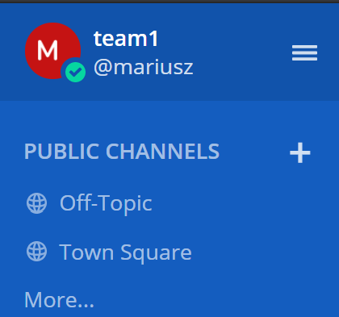
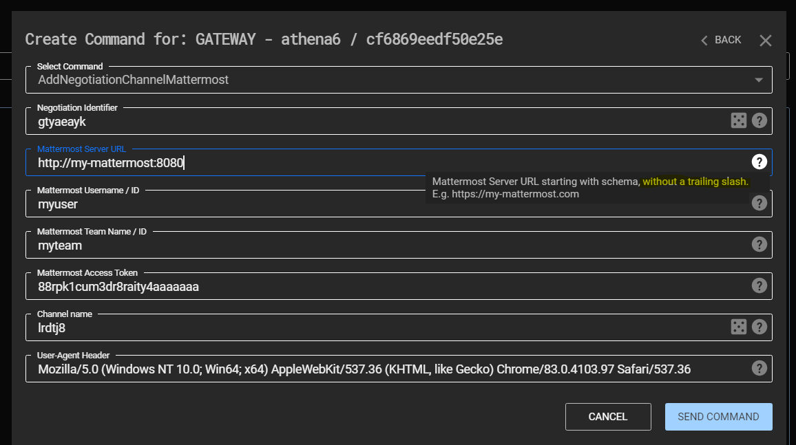
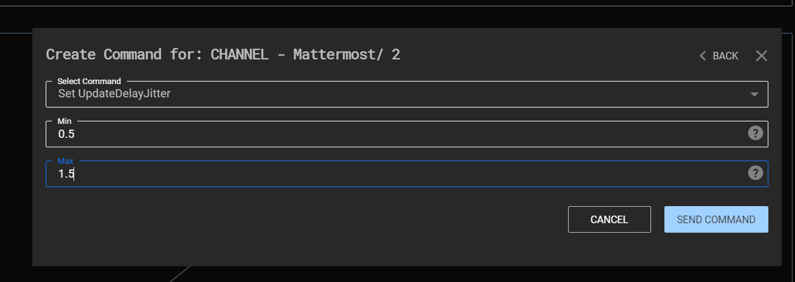

# Mattermost Channel

Mattermost is an open-source alternative for Slack or Discord communication platforms. 
Offers a team collaborations through dedicated "Team" workspaces (analogy to Slack's Workspaces or Discord servers), where each team can contain a number of both public and private channels. 

Such an architecture makes it a perfect candidate for store-and-fetch type of communication channel for frameworks such as C3. The C3 channel implementation is based on Tim's Slack one, leveraging similar post and replies data storage principles.


## Setup

Mattermost instances may be located inside of target networks deployed manually for internal development teams purposes, or an instance could be installed by Red Team operator on a dedicated infrastructure.

Installation guide can be found here:
https://docs.mattermost.com/install/prod-docker.html

The freeware edition is sufficient to utilise it as a channel and SMTP setup is not required.

Prior to using Mattermost API within C3, the steps below must be followed.
1. Install or locate Mattermost server to use.
2. Create an account and either join to a Team or create a new one. Save that Team's name somewhere, as its going to be needed later on.



3. Generate Personal Access Token clicking on your _user name -> Account Settings -> Security -> Personal Access Tokens_


3. Insert the generated Personal Access Token to C3 channel.

### Notice

If there is no _Personal Access Tokens_ part of an interface available, this will mean that functionality was not enabled in Mattermost's system console (which in turn is available only for Mattermost admins). 

Assuming you have administrative rights over your Mattermost server, you can enable that functionality by going to:
_System Console -> Integrations -> Integration Management -> Enable Personal Access Tokens_

(URL: `/admin_console/integrations/integration_management`)


## Channel creation

Now, to actually create your channel you will need following parameters to get straight:

1. **Server URL** - the full URL of the server, that starts with a scheme (http/https), contains port number one's needed and **does not** end with a trailing slash. Example: `https://my-mattermost.com:8080`

2. **Team Name** - The team that will have channels created to facilitate communication. First screenshot in this page indicates that team is named `team1`

3. **Access Token** - The Personal Access Token value, should be something like that: `chhtxfgmzhfct5qi5si7tiexuc`




## Rate Limit

There is a rate limiting implemented for Mattermost API. Consecutive requests will quickly be bounced off by nginx with HTTP 429 status code. Should that occur, Mattermost C3 channel will cool down before resending affected request with a random delay between 10 to 20 seconds. More information can be found here: [Mattermost API Rate Limiting](https://api.mattermost.com/#tag/rate-limiting)

You can change the Rate Limitting threshold or even disable that functionality if you have access to the Mattermost configuration files on the server it's been launched. 

To do so, edit the `config.json` file located at:

```
mattermost-docker/volumes/app/mattermost/config/config.json
```

Find `RateLimitSettings` section and flip the `Enable` from `true` to `false` option:

```
"RateLimitSettings": {
        "Enable": false,
        "PerSec": 10,
        "MaxBurst": 100,
        "MemoryStoreSize": 10000,
        "VaryByRemoteAddr": true,
        "VaryByUser": false,
        "VaryByHeader": ""
    },
```

After that you'll have to restart your Mattermost server. If it's been ran using `docker-compose` then like so:

```
mattermost-docker/ $ sudo docker-compose restart
```

After that you'll be free to issue `Set UpdateDelayJitter` command on your C3 Channel with values of your choosal.


